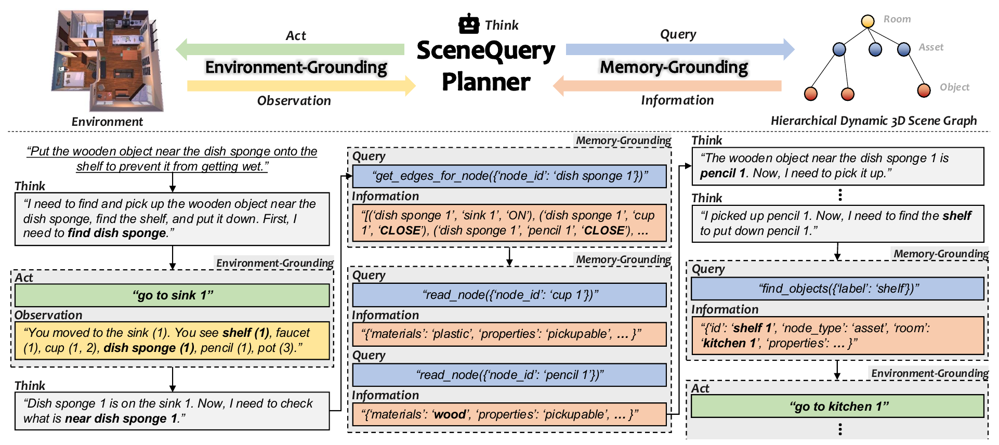

# SceneQueryPlanner

**Memory–Environment Dual-Grounding for Embodied Agents: Active Information Seeking Beyond Passive Observation**

### Accepted to Findings of EMNLP 2026

### [Paper](TODO) | [Project Page](TODO)

[Jae-Woo Choi](https://choi-jaewoo.github.io/)<sup>1, 2, \*</sup>, Sehoon Oh<sup>3, \*</sup>, Ue-Hwan Kim<sup>3, †</sup>

<sup>1</sup> Electronics and Telecommunications Research Institute (ETRI), <sup>2</sup> University of Science and Technology (UST), <sup>3</sup> Department of AI, Gwangju Institute of Science and Technology (GIST)

<sup>\*</sup> Equal contribution, <sup>†</sup> Corresponding author

SceneQueryPlanner is an LLM-based embodied task planner that treats information acquisition as a first-class planning action. The agent interleaves three action types — `Think:` (reasoning), `Act:` (environment grounding), and `Query:` (memory grounding) — where `Query:` issues structured queries (`find_objects`, `read_node`, `get_child_node_names`, `get_edges_for_node`) against a dynamic hierarchical 3D scene graph built from partial observations.

<p align="center"></p>

This repository provides a single codebase for both benchmarks used in the paper, **AttPlan-Bench** (ours, ProcTHOR / AI2-THOR) and **WAH-NL** (VirtualHome), together with our planner and all baselines compared in the paper.

| `task_planner` | Planner | Memory |
|---|---|---|
| `reactstrq` | **SceneQueryPlanner** (ours) | dynamic 3D scene graph, accessed through structured queries |
| `react` | ReAct | none (observation only) |
| `reactwm` | Naive WM | dynamic 3D scene graph, single `recall_location_of` query |
| `sayplan` | SayPlan | static full 3D scene graph, semantic search |
| `moma` | MoMa-LLM | dynamic 3D scene graph, serialized into the prompt |

## Repository layout

```
core/conf/      Hydra configs: config_procthor.yaml (AttPlan-Base), config_procthor_attribute.yaml (AttPlan-Attr), config_wah.yaml (WAH-NL)
core/run/       Entry points: eval, collect_human, collect_llm, embed_em_*
core/planner/   Planning loops for each planner (per-simulator variants under procthor/ and wah/)
core/llm_agent/ LLM interfaces (guidance-based; HF Transformers or OpenAI) and in-context example retrieval
core/retriever/ Structured-query parsing and execution over the scene graph
core/wm/        Working-memory 3D scene graphs
core/env/       Simulator wrappers (procthor_env.py, wah_env.py)
dataset/        AttPlan-Bench task sets and WAH-NL splits
resource/       System prompts, object dictionaries, in-context example banks
script/         Stage-by-stage pipelines for both benchmarks
virtualhome/    Vendored VirtualHome Python package (Unity binary downloaded separately)
```

## Datasets

**AttPlan-Bench** consists of long-horizon household tasks in ProcTHOR-10K houses with two test sets: *AttPlan-Base* (10 ALFRED-style task types × 50 episodes) and *AttPlan-Attr* (250 episodes), where objects are referred to by material, affordance, or spatial relation (e.g., "the item made of glass that is close to the ladle"). AttPlan-Attr includes an `AttributeHard` subset (100 episodes) in which the target is identified by a state set at episode start — dirty, toggled on, broken, open, or cooked. **WAH-NL** is the natural-language version of Watch-And-Help in VirtualHome.

| File | Episodes | Used for |
|---|---|---|
| `dataset/attplan_base_train.json` | 500 | Bootstrapping in-context examples (AttPlan-Base) |
| `dataset/attplan_base_test.json` | 500 (10 task types × 50) | AttPlan-Base evaluation |
| `dataset/attplan_attr_train.json` | 284 (incl. 100 AttributeHard) | Bootstrapping in-context examples (AttPlan-Attr) |
| `dataset/attplan_attr_test.json` | 250 (incl. 100 AttributeHard) | AttPlan-Attr evaluation |
| `dataset/wah_nl_train_rev.json` | 250 | Bootstrapping in-context examples (WAH-NL) |
| `dataset/wah_nl_test_rev.json` | 100 | WAH-NL evaluation |

Each AttPlan episode is `{env_id, mode, instruction, task_goal}` (`env_id` indexes a ProcTHOR-10K test house; `instruction` holds up to four paraphrases, one sampled per evaluation with a fixed seed). `AttributeHard` episodes additionally carry `init_action` and `init_state_hard`, which set the target object's state before the episode starts. ProcTHOR house definitions are bundled in `core/utils/test.jsonl.gz`.

## Installation

Tested on Ubuntu 22.04, Python 3.8, a single NVIDIA GPU with ≥ 24 GB memory (8B models in fp16).

```bash
conda create -n sqp python=3.8
conda activate sqp

# Install PyTorch first (pick the wheel matching your CUDA; see https://pytorch.org)
pip install torch==2.4.1 --index-url https://download.pytorch.org/whl/cu118

pip install -r requirements.txt
```

Credentials are read from environment variables:

```bash
export HF_TOKEN=...         # required for gated HF models (e.g., Llama 3.1)
export OPENAI_API_KEY=...   # only for OpenAI backends
```

### Simulators

- **ProcTHOR / AI2-THOR** — installed by `requirements.txt` (`ai2thor==5.0.0`). The Unity build (~1 GB) is downloaded automatically into `~/.ai2thor/` the first time a controller starts; the ProcTHOR-10K test houses are bundled in `core/utils/test.jsonl.gz`, so no separate dataset download is needed. An X display is required (`DISPLAY=:0`, or an Xvfb/Xorg display on a headless server).
- **VirtualHome** — the Python package is vendored under `virtualhome/`; only the Unity simulator binary must be downloaded (see [Evaluating on WAH-NL](#evaluating-on-wah-nl-virtualhome)).

## Evaluating on AttPlan-Bench (ProcTHOR)

From the repository root:

```bash
sh script/procthor_05_evaluate.sh
```

The script runs SceneQueryPlanner on AttPlan-Base and AttPlan-Attr with Llama-3.1-8B; baseline commands are included commented-out. The two subsets differ only in the config:

```bash
# AttPlan-Base
python -m core.run.eval --config-name=config_procthor task_planner=reactstrq \
    llm_agent.model_name='meta-llama/Llama-3.1-8B' llm_agent.max_decision_step=199 \
    llm_agent.em_dir='resource/trajectory/em_llm_procthor/reactstrq' \
    llm_agent.sys_prompt_path='resource/sys_prompt/procthor/reactstrq.txt'

# AttPlan-Attr (example banks are selected per task mode by the config)
python -m core.run.eval --config-name=config_procthor_attribute task_planner=reactstrq \
    llm_agent.model_name='meta-llama/Llama-3.1-8B' llm_agent.max_decision_step=199 \
    llm_agent.sys_prompt_path='resource/sys_prompt/procthor/reactstrq.txt'
```

Results are logged per task type and overall into the Hydra run directory (`outputs/<dataset>-<planner>/<timestamp>/eval.log`).

## Evaluating on WAH-NL (VirtualHome)

1. Download the VirtualHome Unity simulator:

    ```bash
    cd virtualhome/simulation/unity_simulator/
    wget http://virtual-home.org//release/simulator/v2.0/v2.2.2/linux_exec.zip
    unzip linux_exec.zip
    cd -
    ```

2. Run the simulator in one terminal. The Unity player shows a resolution-selection dialog on launch; for unattended runs disable it once by renaming the plugin, then start the player with explicit screen options:

    ```bash
    mv virtualhome/simulation/unity_simulator/linux_exec_Data/Plugins/x86_64/ScreenSelector.so \
       virtualhome/simulation/unity_simulator/linux_exec_Data/Plugins/x86_64/ScreenSelector.so.disabled
    ./virtualhome/simulation/unity_simulator/linux_exec.x86_64 -screen-fullscreen 0 -screen-width 640 -screen-height 480
    ```

    The evaluation connects to the running simulator on port 8080 (`environment.use_editor: True` in `config_wah.yaml`).

3. Evaluate in another terminal:

    ```bash
    sh script/wah_05_evaluate.sh
    ```

## Full pipeline

Evaluation uses the in-context example banks shipped under `resource/trajectory/` (`em_llm_procthor/`, `em_llm_procthor/using_attributes{,_hard}/`, `em_llm_wah/`). To rebuild them from scratch, run the five stages in order (per benchmark):

| Stage | ProcTHOR | VirtualHome |
|---|---|---|
| 1. Collect human demos (interactive) | `script/procthor_01_collect_human.sh` | `script/wah_01_collect_human.sh` |
| 2. Embed human trajectories | `script/procthor_02_embed_human_traj.sh` | `script/wah_02_embed_human_traj.sh` |
| 3. Collect LLM trajectories | `script/procthor_03_collect_llm.sh` | `script/wah_03_collect_llm.sh` |
| 4. Embed LLM trajectories | `script/procthor_04_embed_llm_traj.sh` | `script/wah_04_embed_llm_traj.sh` |
| 5. Evaluate | `script/procthor_05_evaluate.sh` | `script/wah_05_evaluate.sh` |

All entry points are Hydra CLIs; planner, model, prompt, and example bank are selected via overrides (`task_planner`, `llm_agent.model_name`, `llm_agent.sys_prompt_path`, `llm_agent.em_dir`, `procthor.eval_set`, ...). Metrics reported per run: Task Success Rate (TSR), Subgoal Success Rate (SSR), and the average number of decision steps over successful episodes.

## License

This project is released under the MIT License (see [LICENSE](LICENSE)). The vendored VirtualHome package under `virtualhome/` retains its own license (CC BY-NC-SA 4.0); see `virtualhome/LICENSE.md`.

## Citation

```bibtex
@inproceedings{choi2026scenequeryplanner,
  title     = {Memory--Environment Dual-Grounding for Embodied Agents: Active Information Seeking Beyond Passive Observation},
  author    = {Choi, Jae-Woo and Oh, Sehoon and Kim, Ue-Hwan},
  booktitle = {Findings of the Association for Computational Linguistics: EMNLP 2026},
  year      = {2026}
}
```
